# gh0st Website

<p align="center">
  <picture>
    <source media="(prefers-reduced-motion: reduce)" srcset="assets/hero/hero-reduced.svg">
    <source media="(prefers-color-scheme: light)" srcset="assets/hero/hero-light.svg">
    
  </picture>
</p>

<p align="center">
  <picture>
    <source media="(prefers-reduced-motion: reduce)" srcset="assets/hero/computational-dark.svg">
    <source media="(prefers-color-scheme: light)" srcset="assets/hero/computational-light.svg">
    
  </picture>
</p>

Official website for gh0st — local-first private AI with a current encrypted CLI workflow and early native clients.

## Development

```bash
# Install dependencies
pnpm install

# Development server
pnpm dev

# Type check
pnpm typecheck

# Lint
pnpm lint

# Production build
pnpm build

# Preview production build
pnpm start
```

## Deployment

This is a Next.js static export configured for Vercel deployment.

```bash
# Deploy to Vercel (requires Vercel CLI)
vercel --prod
```

## Project Structure

```
src/
├── app/                    # Next.js App Router pages
│   ├── security/          # Security page
│   ├── privacy/           # Privacy page
│   ├── download/          # Download page
│   ├── docs/              # Documentation pages
│   ├── faq/               # FAQ page
│   ├── layout.tsx         # Root layout
│   ├── page.tsx           # Homepage
│   ├── not-found.tsx      # 404 page
│   └── sitemap.ts         # Sitemap generation
├── components/
│   ├── layout/            # Header, Footer
│   ├── ui/                # Reusable UI components
│   ├── sections/          # Homepage sections
│   └── demo/              # Interactive demo
├── styles/
│   └── globals.css        # Global styles
└── public/
    ├── robots.txt
    ├── favicon.svg
    └── gh0st-mark.svg
```

## Tech Stack

- Next.js 14 (App Router, Static Export)
- React 18
- TypeScript
- Tailwind CSS
- pnpm

## Design Principles

- Dark mode default
- Neutral color palette
- Minimal motion (respects prefers-reduced-motion)
- Accessible by default
- No analytics, no tracking
- Fast static generation

## License

MIT License — see [LICENSE](LICENSE) for details.

<!-- TRILLIONX:presentation:begin -->

### Animated surfaces

Generated from this repository's own source tree: every count, route and module below was measured, not written by hand.

#### Identity

<picture>
  <source media="(prefers-reduced-motion: reduce)" srcset="https://raw.githubusercontent.com/M4G3LL4N0/gh0st-website/main/.github-art/surfaces/hero-reduced.svg">
  <source media="(prefers-color-scheme: light)" srcset="https://raw.githubusercontent.com/M4G3LL4N0/gh0st-website/main/.github-art/surfaces/hero-light.svg">
  
</picture>

#### Modules

<picture>
  <source media="(prefers-reduced-motion: reduce)" srcset="https://raw.githubusercontent.com/M4G3LL4N0/gh0st-website/main/.github-art/surfaces/architecture-reduced.svg">
  <source media="(prefers-color-scheme: light)" srcset="https://raw.githubusercontent.com/M4G3LL4N0/gh0st-website/main/.github-art/surfaces/architecture-light.svg">
  
</picture>

#### Routes

<picture>
  <source media="(prefers-reduced-motion: reduce)" srcset="https://raw.githubusercontent.com/M4G3LL4N0/gh0st-website/main/.github-art/surfaces/data_flow-reduced.svg">
  <source media="(prefers-color-scheme: light)" srcset="https://raw.githubusercontent.com/M4G3LL4N0/gh0st-website/main/.github-art/surfaces/data_flow-light.svg">
  
</picture>

#### Primitives

<picture>
  <source media="(prefers-reduced-motion: reduce)" srcset="https://raw.githubusercontent.com/M4G3LL4N0/gh0st-website/main/.github-art/surfaces/state_machine-reduced.svg">
  <source media="(prefers-color-scheme: light)" srcset="https://raw.githubusercontent.com/M4G3LL4N0/gh0st-website/main/.github-art/surfaces/state_machine-light.svg">
  
</picture>

#### Composition

<picture>
  <source media="(prefers-reduced-motion: reduce)" srcset="https://raw.githubusercontent.com/M4G3LL4N0/gh0st-website/main/.github-art/surfaces/component_map-reduced.svg">
  <source media="(prefers-color-scheme: light)" srcset="https://raw.githubusercontent.com/M4G3LL4N0/gh0st-website/main/.github-art/surfaces/component_map-light.svg">
  
</picture>

#### Build and tests

<picture>
  <source media="(prefers-reduced-motion: reduce)" srcset="https://raw.githubusercontent.com/M4G3LL4N0/gh0st-website/main/.github-art/surfaces/build-reduced.svg">
  <source media="(prefers-color-scheme: light)" srcset="https://raw.githubusercontent.com/M4G3LL4N0/gh0st-website/main/.github-art/surfaces/build-light.svg">
  
</picture>

#### Workflow

<picture>
  <source media="(prefers-reduced-motion: reduce)" srcset="https://raw.githubusercontent.com/M4G3LL4N0/gh0st-website/main/.github-art/surfaces/workflow-reduced.svg">
  <source media="(prefers-color-scheme: light)" srcset="https://raw.githubusercontent.com/M4G3LL4N0/gh0st-website/main/.github-art/surfaces/workflow-light.svg">
  
</picture>

#### Domain

<picture>
  <source media="(prefers-reduced-motion: reduce)" srcset="https://raw.githubusercontent.com/M4G3LL4N0/gh0st-website/main/.github-art/surfaces/domain-reduced.svg">
  <source media="(prefers-color-scheme: light)" srcset="https://raw.githubusercontent.com/M4G3LL4N0/gh0st-website/main/.github-art/surfaces/domain-light.svg">
  
</picture>

#### Identity object

<picture>
  <source media="(prefers-reduced-motion: reduce)" srcset="https://raw.githubusercontent.com/M4G3LL4N0/gh0st-website/main/.github-art/surfaces/footer-reduced.svg">
  <source media="(prefers-color-scheme: light)" srcset="https://raw.githubusercontent.com/M4G3LL4N0/gh0st-website/main/.github-art/surfaces/footer-light.svg">
  
</picture>

<!-- TRILLIONX:presentation:end -->

<!-- TRILLIONX:evidence:begin -->

## What is measurable here

Generated by `.github-art` from the source tree at publish time.

| Signal | Value |
| --- | --- |
| HTTP routes | 15 |
| Entry points | 0 |
| Module roots | 1 |
| Test files | 0 |
| CI workflows | 0 |
| Distinctive stack | scaffold only |
| Status | PROTOTYPE |
| Evidence confidence | E3 |
| Animated surfaces | 9 |

<!-- TRILLIONX:evidence:end -->
